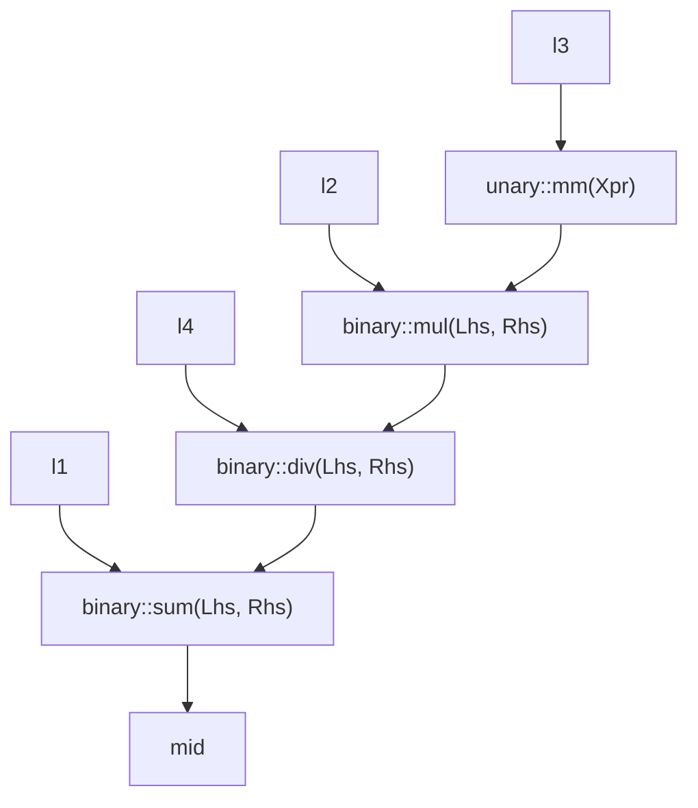

# My Cpp Lazy Sample ~ Everything Becomes a Type ~
演算を型情報に変換し，castするタイミングで評価するプログラムです．

## Requirements
- `CXX Compiler`
  - Support `c++17`
- `make`
- `c++filt`
  - For type info

## Build
```sh
git clone https://github.com/m12watanabe1a/my_cpp_lazy_sample.git && cd my_cpp_lazy_sample
make run
```

## 単行演算子 (`T(T)`)
|       型        | 評価 `op` (`<op> Xpr`) |
| :-------------: | :--------------------: |
| `op::unary::pp` |          `+`           |
| `op::unary::mm` |          `-`           |

## 二項演算子 `T(T, T)`

|        型         | 評価 `op` (`lhs <op> rhs`) |
| :---------------: | :------------------------: |
| `op::binary::sum` |            `+`             |
| `op::binary::sub` |            `-`             |
| `op::binary::mul` |            `*`             |
| `op::binary::div` |            `/`             |

### 例
```c++
auto mid = l1 + l2 * -l3 / l4;
```
`lazy<T>`型である変数`l1` ~ `l4`は以下のように型変換されます．



以上の型情報を再帰的に上に向かって値にcastすることで演算が実行されます．
